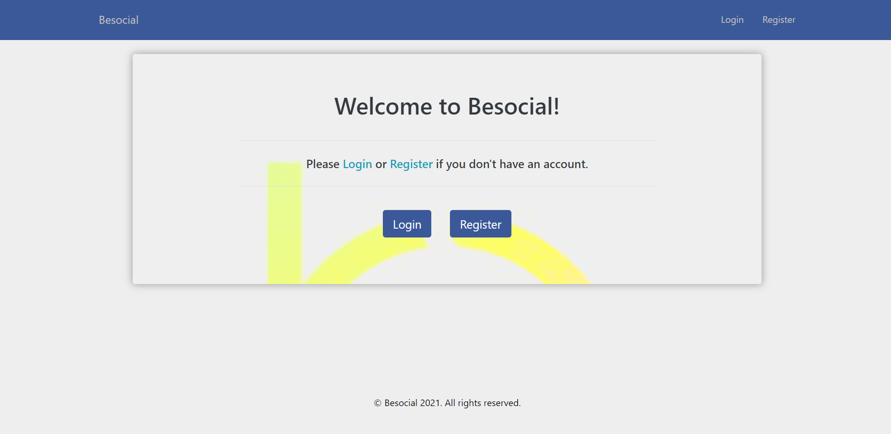
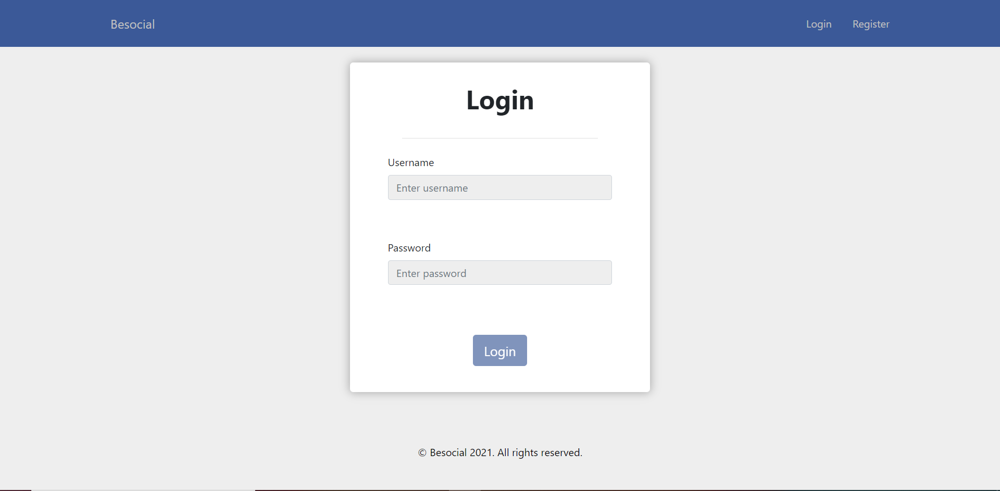
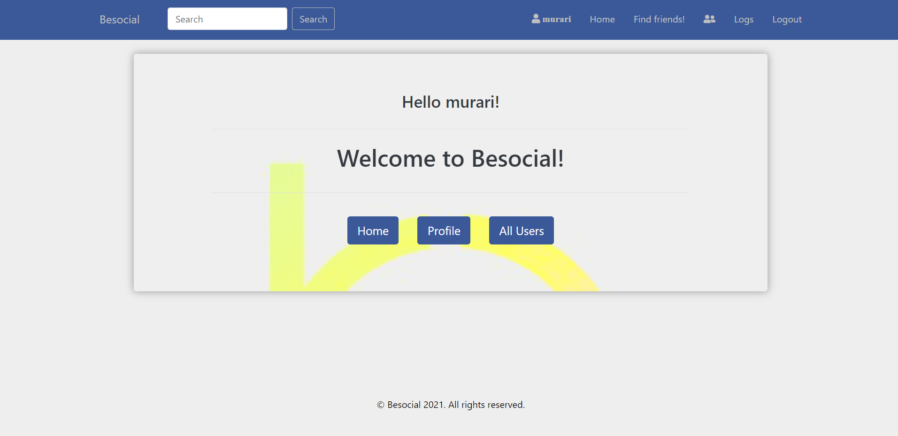
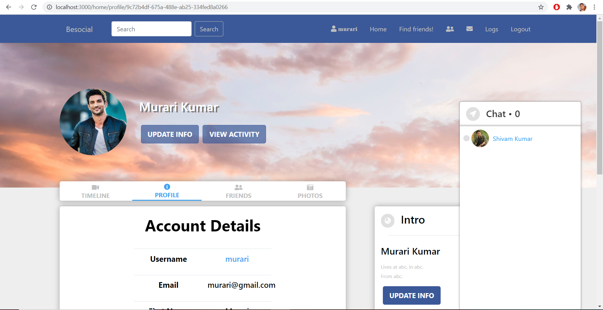
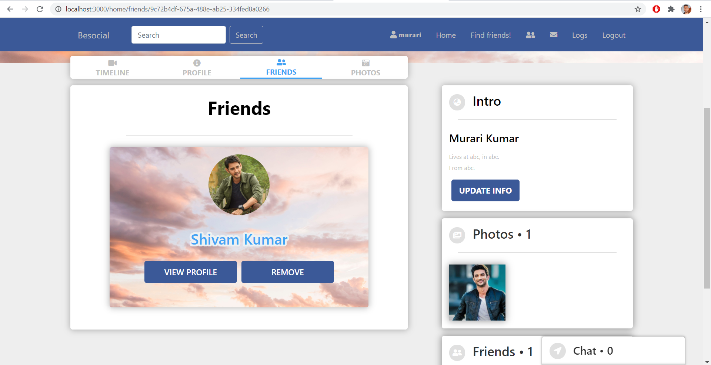
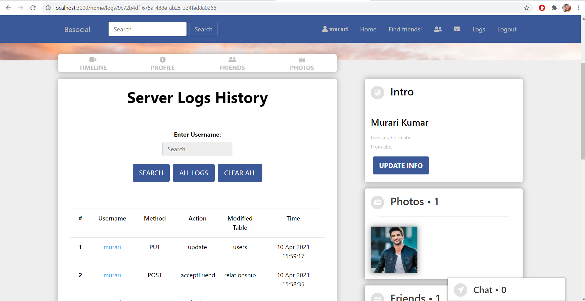

# Besocial

Social-Network is a Stateful app built with [Spring Boot](http://spring.io/projects/spring-boot), [MySQL](https://www.mysql.com/) and [React](https://reactjs.org/).

Features:
- Routing
- User authentication: Register/Login/Logout
- 3 User Roles: Root, Admin and User
- Promoting/Demoting users to Admin/User
- Creating and deleting users
- Editing user profile
- Searching for friends
- Sending and accepting friend requests
- Removing friends from the friends list
- Adding and deleting photos
- Creating and deleting posts
- Creating and deleting comments
- Chat functionality: writing and receiving messages from your friends
- Logs history

The project will be deployed soon.


## Requirements

1. Java 11

2. In order to be able to save `Photos` you need to sign up to [Cloudinary](https://cloudinary.com/) and enter your credentials in the `application.properties` file of the Spring Boot app (`Besocial\Server\src\main\resources\application.properties`)

## Start the app

#### 1. Start the Client

To start the Client you need to enter the `Besocial/Client` folder:

```bash
$ cd Besocial/Client
```

Install all dependencies:

```bash
$ npm install
```

Run the app in the development mode:

```bash
$ npm start
```

Open [http://localhost:3000](http://localhost:3000) to view it in the browser.

#### 2. Start the Server

Go to the root directory of the Spring Boot app:

```bash
$ cd Besocial/Server
```

Start the Server:

```bash
$ mvn spring-boot:run
```
The Server is running on port `8000`.


## App screenshots

1. **Welcome Page**

 

2. **Login Page**

 


3. **Home Page**

 

 4. **Profile Page**

 

5. **Friends Page**

 

6. **Log Page**

 
